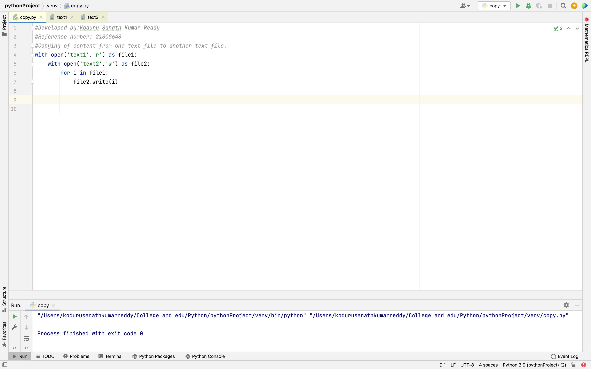
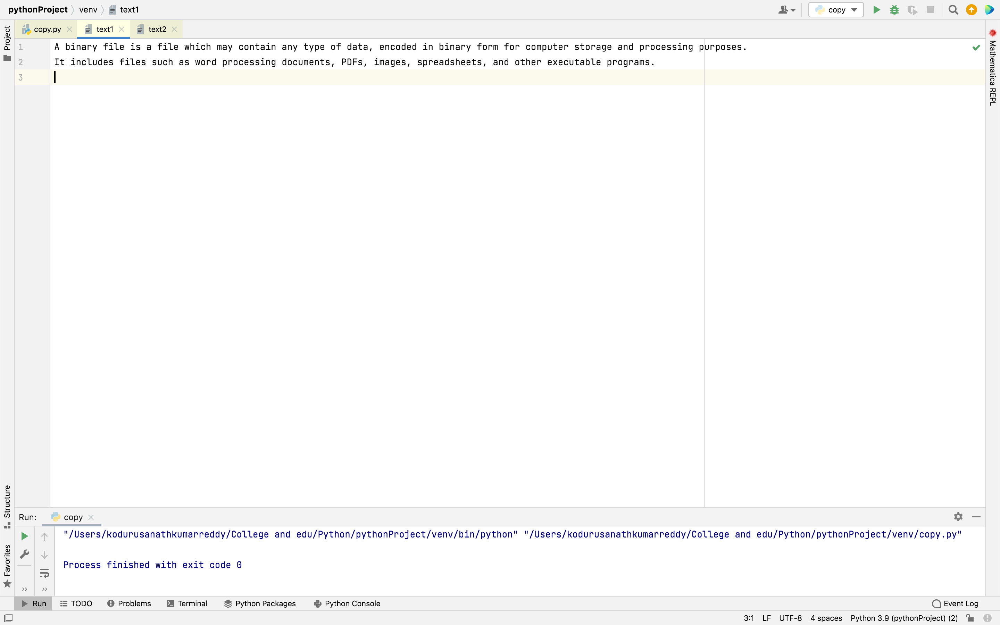
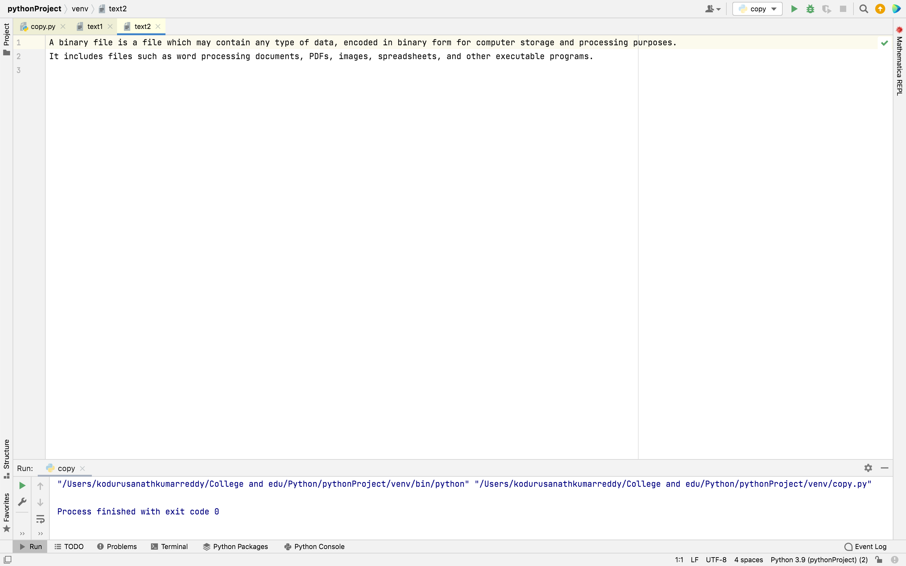

# copy-file
## AIM:
To write a python program for copying the contents from one file to another file.
## EQUIPEMENT'S REQUIRED: 
PC
Anaconda - Python 3.7
## ALGORITHM: 
### Step 1:
Start
### Step 2: 
Open the first file in read mode by an appropriate method.
### Step 3: 
Open the second file in write mode by an appropriate method.
### Step 4:  
Loop until a variable 'i' in the first file. So variable i propagates all over the content. 
### Step 5:
write the value of 'i' in the second file by following method.
SecondileName.write(i) 
### Step 6: 
Stop

## PROGRAM:
~~~
#Developed by:Koduru Sanath Kumar Reddy
#Reference number: 21000648
#Copying of content from one text file to another text file.
with open('text1','r') as file1:
    with open('text2','w') as file2:
        for i in file1:
            file2.write(i)
~~~

## OUTPUT:
### Program:

### File1:

### File2:

## RESULT:
Thus the program is written to copy the contents from one file to another file.